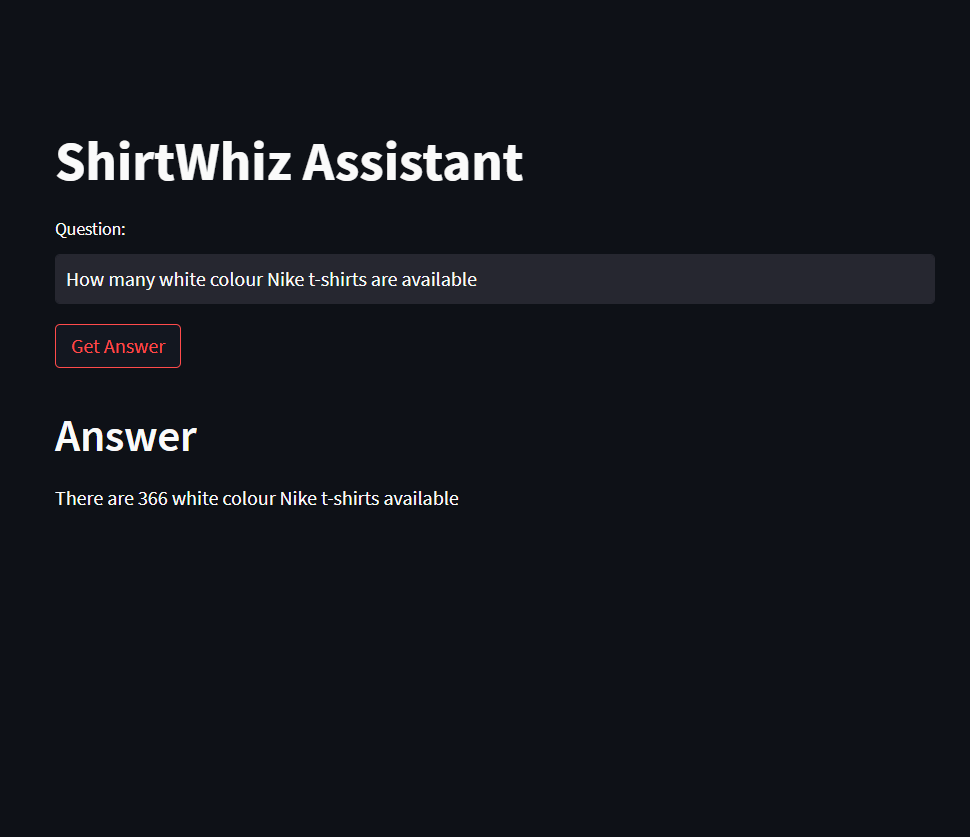

# ShirtWiz

ShirtWhiz Assistant is a chatbot tailored for a T-shirt store. Developed using Streamlit for a user-friendly web interface, it leverages Langchain's SQL database connectivity with SQLite. Powered by Google Palm as the language model and enhanced with Hugging Face embeddings, it delivers quick and accurate responses to user queries.


## Tech 

**Database:** SQLite

**Framework:** Langchain

**LLM:** Google Palm

**Emmbedding:** HuggingFace

**Vector store:** ChromaDB

**Interface:** Streamlit


## Environment Variables

To run this project, you will need to add the following environment variables to your .env file

`GOOGLE_API_KEY`
 
 go to this link and get your key
 
`https://makersuite.google.com/app/home`


## Run Locally

Clone the project

```bash
  git clone https://github.com/Rahulathreya45/ShirtWiz
```

Go to the project directory

```bash
  cd ShirtWiz
```

Install dependencies

```bash
  pip Install -r req.txt
```

Start the server

```bash
  python -m streamlit run app.py
```


## Screenshots




## Appendix

Uncomment the SQLite code in **Main.py** as it is required to populate the Database

